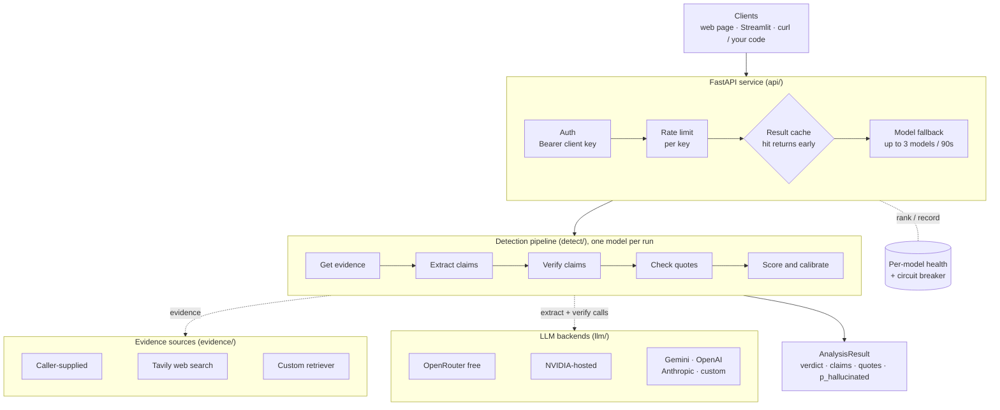
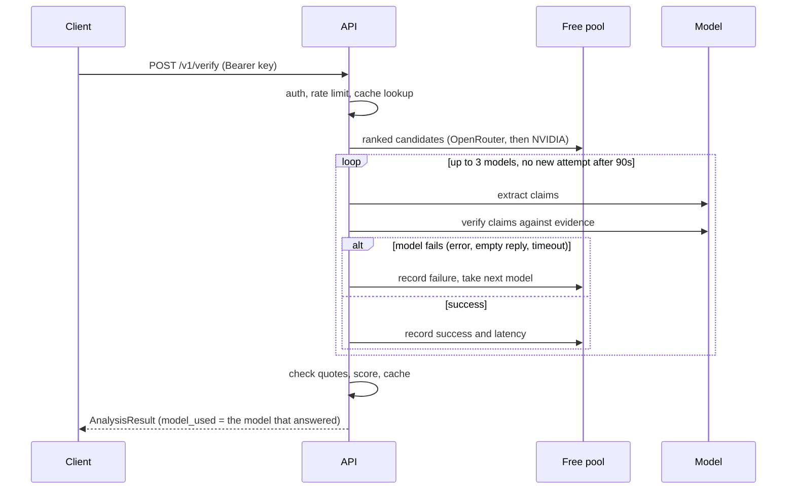

# HALLUDETECT

[](https://github.com/mohanmarimuthu1/HALLUCINATION-DETECTION/actions/workflows/ci.yml)

A hallucination verification service. Give it an answer, from any LLM or
any person, and the evidence it should be based on. It splits the answer
into claims, checks each claim against that evidence, and returns a
verdict with the exact quote that backs or contradicts each claim.

It can also act as a checked chatbot: ask a question, a model answers it,
and a different model checks every claim in that answer against the
sources. A model performance view tracks, per model, how often its
answers turned out unsupported or contradicted.

**Live:** https://hallucination-detection-azure.vercel.app (needs an
access key, see [Web page](#web-page)).

The rule the whole design serves: **the verifier never uses a model's own
knowledge as evidence.** A claim is `SUPPORTED` only when the model cites
a quote and the service finds that quote, word for word, in the evidence.
With no evidence, the answer is `NOT_VERIFIABLE`, never a guess.

## Contents

- [What it returns](#what-it-returns)
- [How it works](#how-it-works)
- [Architecture](#architecture)
- [Tech stack](#tech-stack)
- [Requirements](#requirements)
- [Quick start](#quick-start)
- [Configuration](#configuration)
- [API reference](#api-reference)
- [Model backends](#model-backends)
- [Evidence sources](#evidence-sources)
- [Scoring and calibration](#scoring-and-calibration)
- [Clients](#clients)
- [Deployment](#deployment)
- [Testing and evaluation](#testing-and-evaluation)
- [Project layout](#project-layout)
- [Design decisions](#design-decisions)
- [Known limitations](#known-limitations)
- [Legacy v1 app](#legacy-v1-app)

## What it returns

Real output for an answer with one planted error ("Berlin"):

```json
{
  "verdict": "CONTRADICTED",
  "p_hallucinated": 0.976,
  "groundedness": 0.667,
  "groundedness_ci": [0.208, 0.939],
  "claims": [
    {"claim_id": "claim-0", "text": "The Eiffel Tower is 330 metres tall.",
     "label": "SUPPORTED", "quote": "It is 330 metres tall.", "quote_verified": true,
     "evidence_chunk_ids": ["direct-0"], "confidence": 1.0},
    {"claim_id": "claim-1", "text": "The Eiffel Tower was completed in 1889.",
     "label": "SUPPORTED", "quote": "Construction began in 1887 and it was completed in 1889.",
     "quote_verified": true, "evidence_chunk_ids": ["direct-1"], "confidence": 1.0},
    {"claim_id": "claim-2", "text": "The Eiffel Tower stands in Berlin.",
     "label": "CONTRADICTED", "quote": "The Eiffel Tower is on the Champ de Mars in Paris, France.",
     "quote_verified": true, "evidence_chunk_ids": ["direct-0"], "confidence": 1.0}
  ],
  "n_verifiable_claims": 3,
  "model_used": {"provider": "openrouter", "model": "stealth/space-bunny-alpha"},
  "cost_usd": 0.0,
  "timings_ms": {"total": 8360, "retrieval": 0, "extraction": 1735, "verification": 6625},
  "calibration_version": "verdict-rate-v1",
  "reason": null
}
```

| Verdict | Meaning |
|---|---|
| `GROUNDED` | Every checkable claim is supported by a verified quote. |
| `CONTRADICTED` | At least one claim is contradicted by the evidence. |
| `NOT_ENOUGH_INFO` | Nothing is contradicted, but at least one claim isn't covered by the evidence. |
| `NOT_VERIFIABLE` | No evidence was available (`reason: no_evidence_configured`), or the answer has fewer than 3 checkable claims (`reason: insufficient_verifiable_claims`). |

## How it works

1. **Get evidence.** Use the caller's `evidence`, or fetch it from web
   search or a registered retriever. Long passages are split into chunks
   of up to 1,000 characters, each with an id (`direct-0`, `direct-1`, ...).
   If there is no evidence, stop here: `NOT_VERIFIABLE`, and no model is called.
2. **Extract claims.** An LLM splits the answer into up to 12 claims and
   types each one: `FACTUAL`, `OPINION`, `INSTRUCTION` or `META`. Only
   `FACTUAL` claims are checked.
3. **Verify.** A second LLM call labels each claim `SUPPORTED`,
   `CONTRADICTED` or `NOT_ENOUGH_INFO`, citing chunk ids and a quote. The
   prompt forbids using the model's own knowledge. Verdicts are matched to
   claims by `claim_id`, never by position.
4. **Check quotes.** The service searches the cited chunks for the quote
   (exact match after collapsing whitespace). A `SUPPORTED` label whose
   quote isn't found is downgraded to `NOT_ENOUGH_INFO` before the
   response is built.
5. **Score.** Combine the claim labels into a verdict, a calibrated
   `p_hallucinated`, a groundedness fraction and its Wilson 95% interval.
   Fewer than 3 checkable claims forces `NOT_VERIFIABLE`.

Both LLM calls ask for JSON matching a schema. Output that doesn't
validate gets up to 2 repair retries, then the call fails with an error.
A partial parse is never used.

## Architecture



A request on the default free pool:



One result always comes from one model: if a model fails partway through,
the whole pipeline re-runs on the next one, so `model_used` is exact.

## Tech stack

| Layer | Choice |
|---|---|
| Language | Python 3.11 or 3.12 |
| API | FastAPI, Uvicorn |
| Validation and settings | Pydantic v2, pydantic-settings (every key is a `SecretStr`) |
| HTTP to model providers | httpx, called directly (no vendor SDKs) |
| Result cache | diskcache (file-backed, survives restarts) |
| Logging | structlog, JSON lines with a per-request `request_id` |
| Golden sets | YAML (PyYAML) |
| Web page | One HTML file, plain JavaScript, no build step, no external requests |
| Demo UI | Streamlit (optional extra) |
| LLM backends | OpenRouter free models, NVIDIA-hosted models, Gemini, OpenAI, Anthropic, any OpenAI-compatible endpoint |
| Web search | Tavily (optional) |
| Quality | pytest, ruff, mypy, GitHub Actions |
| Deploy | Docker / docker-compose, Vercel |

## Requirements

- Python **3.11 or 3.12** (`requires-python = ">=3.11,<3.13"`).
- An **OpenRouter API key** (free at openrouter.ai), or an **NVIDIA API
  key** (free at build.nvidia.com), or both. Without either, only
  your own Gemini/OpenAI/Anthropic key can serve requests.
- At least one **client key** you make up yourself (`CLIENT_API_KEYS`).
  Callers send it to use the service.
- Optional: a Tavily key for web-search evidence, Docker for containers,
  the Vercel CLI (`npx vercel`) to deploy there.

Running the tests needs no keys and no network.

## Quick start

```bash
git clone https://github.com/mohanmarimuthu1/HALLUCINATION-DETECTION.git
cd HALLUCINATION-DETECTION
python -m venv .venv
source .venv/bin/activate          # Windows: .venv\Scripts\activate
pip install -e ".[dev]"            # add ,ui for the Streamlit client
cp .env.example .env
```

Set at least these in `.env`:

```bash
OPENROUTER_API_KEY=sk-or-...       # and/or NVIDIA_API_KEY=nvapi-...
CLIENT_API_KEYS=pick-any-long-random-string
```

Generate a client key with
`python -c "import secrets; print('hd_' + secrets.token_urlsafe(32))"`.

Run the service:

```bash
uvicorn halludetect.api.main:app --reload
```

- http://localhost:8000: web page
- http://localhost:8000/docs: interactive API docs (Swagger)
- http://localhost:8000/healthz: liveness check

Verify an answer:

```bash
curl -X POST http://localhost:8000/v1/verify \
  -H "Authorization: Bearer <your CLIENT_API_KEYS value>" \
  -H "Content-Type: application/json" \
  -d '{
        "answer": "The Eiffel Tower is 330 metres tall, was completed in 1889, and stands in Berlin.",
        "evidence": ["The Eiffel Tower is on the Champ de Mars in Paris, France. It is 330 metres tall.",
                     "Construction began in 1887 and it was completed in 1889."],
        "evidence_source": "none"
      }'
```

## Configuration

All settings come from environment variables or `.env`
(`src/halludetect/settings.py`). Everything is optional except where noted.

| Variable | Default | Purpose |
|---|---|---|
| `CLIENT_API_KEYS` | none | **Required.** Comma-separated keys callers may use. None set means every request gets 401. |
| `OPENROUTER_API_KEY` | none | OpenRouter free-model pool, the first tier of the default pool. |
| `NVIDIA_API_KEY` | none | NVIDIA-hosted models: `provider: nvidia`, and the second tier of the pool. |
| `NVIDIA_MODELS` | `nvidia/nemotron-3-super-120b-a12b,nvidia/ising-calibration-1.5-31b` | NVIDIA models in the pool, in order. |
| `GEMINI_API_KEY` / `OPENAI_API_KEY` / `ANTHROPIC_API_KEY` | none | Server-side fallback key when a caller picks that provider without sending `user_api_key`. |
| `CUSTOM_PROVIDER_BASE_URL` / `CUSTOM_PROVIDER_API_KEY` | none | An OpenAI-compatible endpoint for `provider: custom`. |
| `TAVILY_API_KEY` | none | Enables `evidence_source: web`. Without it, `web` behaves like `none`. |
| `RATE_LIMIT_CAPACITY` | `60` | Token-bucket size per client key. |
| `RATE_LIMIT_REFILL_PER_S` | `1.0` | Tokens added per second. |
| `CACHE_ENABLED` | `true` | Result cache on or off. |
| `CACHE_DIR` | `.cache/halludetect` | Cache directory. Use `/tmp/halludetect` on Vercel. |
| `CACHE_TTL_S` | `3600` | How long a cached result is served. |
| `RETRY_MAX_ATTEMPTS` | `3` | Retries per model call on rate limits (and timeouts, outside the free pool). |
| `RETRY_BASE_DELAY_S` / `RETRY_MAX_DELAY_S` | `0.5` / `8.0` | Jittered exponential backoff bounds. |
| `FREE_POOL_MAX_ATTEMPTS` | `3` | Models one request tries before returning 502. |
| `FREE_POOL_BUDGET_S` | `90` | No new model attempt starts after this many seconds. |

Streamlit client only: `HALLUDETECT_API_URL` (default
`http://127.0.0.1:8000`) and `HALLUDETECT_API_KEY` (default: the first of
`CLIENT_API_KEYS`).

## API reference

The contract is versioned and frozen: [`docs/contract.md`](docs/contract.md)
(currently v1.3), with a machine-readable copy in
[`docs/openapi.yaml`](docs/openapi.yaml). The running service also serves
its schema at `/openapi.json` and `/docs`.

### Endpoints

| Method | Path | Auth | Purpose |
|---|---|---|---|
| `POST` | `/v1/verify` | Bearer client key | Verify an answer. |
| `POST` | `/v1/chat` | Bearer client key | Answer a question with a model, then verify that answer. |
| `GET` | `/v1/models/stats` | Bearer client key | Per-model performance since the process started. |
| `GET` | `/healthz` | none | Liveness: `{"status": "ok"}`. |
| `GET` | `/` | none | Web page. |
| `GET` | `/docs`, `/openapi.json` | none | API docs. |

### Request body

| Field | Type | Notes |
|---|---|---|
| `answer` | string, required | The text to verify. |
| `question` | string | Optional. Improves claim extraction and is the web-search query. |
| `evidence` | string[] | If non-empty, the only evidence used; `evidence_source` is ignored. |
| `evidence_source` | `none` \| `web` \| `custom`, required | Where to get evidence when `evidence` is empty. |
| `model_prefs.provider` | `openrouter` \| `gemini` \| `openai` \| `anthropic` \| `nvidia` \| `custom` | Default `openrouter`, which means the free pool unless a model is pinned. |
| `model_prefs.pinned_model` | string | Use exactly this model, with no fallback. Required for `custom`. |
| `model_prefs.user_api_key` | string | Your own key for the chosen provider. Never logged or returned. |
| `model_prefs.allow_free_pool` | bool | Default `true`. `false` with `provider: openrouter` needs `pinned_model`, otherwise 400. |

### Chat

`POST /v1/chat` takes `question`, optional `history` (up to 20
`{role, content}` turns, context for the answer only), `evidence`,
`evidence_source` (default `web`) and `model_prefs`. It returns
`answer`, `answer_model`, `answer_ms` and `verification`, a normal
`AnalysisResult` for that answer.

- The answer is checked exactly like a `/v1/verify` answer. It is never
  evidence for itself: with no `evidence` and no `TAVILY_API_KEY`, the
  answer comes back `NOT_VERIFIABLE` / `no_evidence_configured`,
  unchecked.
- The checking model is a different model from the answering one
  whenever the pool has one.
- Both steps fail over across the free pool like `/v1/verify`. An empty
  answer counts as a failed model.

```bash
curl -s http://127.0.0.1:8000/v1/chat \
  -H "Authorization: Bearer $KEY" -H "Content-Type: application/json" \
  -d '{"question": "How tall is the Eiffel Tower?",
       "evidence": ["The Eiffel Tower is 330 metres (1,083 ft) tall."]}'
```

### Model stats

`GET /v1/models/stats` returns one row per model that has been called,
with two blocks:

- `answer`: the model as the chat answering model. Calls, failures,
  latency (avg, p95), the verdicts its answers received, and
  `unsupported_rate` ((CONTRADICTED + NOT_ENOUGH_INFO) / scored) and
  `contradicted_rate`. This is the per-model hallucination measure.
- `verify`: the model as the checking model, with the verdicts it gave. A
  checker that fails to quote turns correct answers into
  `NOT_ENOUGH_INFO`, so a high unsupported rate here points at the checker,
  not at the answers it checked.

Rates count GROUNDED, CONTRADICTED and NOT_ENOUGH_INFO only and are `null`
until there is one. The counters are in memory and per process: on Vercel
each serverless instance has its own, and they reset on a cold start.

### Status codes

| Code | When |
|---|---|
| 200 | An `AnalysisResult`, including `NOT_VERIFIABLE` results. |
| 400 | Invalid request or unusable configuration (e.g. `custom` with nothing registered). |
| 401 | Missing, malformed or unknown client key. |
| 422 | Body fails schema validation. |
| 429 | Rate limit exceeded for this key. |
| 502 | Every model tried failed. The error lists each one and why. |
| 503 | No model is available to try. |

## Model backends

**Default: the free pool.** With `provider: openrouter` and no pinned
model, a request tries:

1. OpenRouter's free models: models whose prompt and completion prices
   are both 0, read from OpenRouter's model catalog (cached for 24 hours).
2. Then the NVIDIA models in `NVIDIA_MODELS`, if `NVIDIA_API_KEY` is set.

Within each tier, models are ranked by success rate, then average
latency. Untried models get a turn first. A model with 3 consecutive
failures is benched for 5 minutes. Rules for moving to the next model:

- An error, empty reply, rate limit that outlasts retries, or timeout
  sends the request to the next model.
- Timeouts aren't retried on the same model: a hung free model is
  usually slower to wait out than switching.
- A 401 (rejected key) skips the rest of that provider, since its models
  share the key. A 403 (key valid, but this model isn't allowed) only
  skips that model.
- At most `FREE_POOL_MAX_ATTEMPTS` models, and no new attempt after
  `FREE_POOL_BUDGET_S`.

NVIDIA's list is set by hand because its catalog can't be trusted. On
2026-09-29, 30 of its 43 listed chat models returned 404 and most others
timed out. Check that a model answers before adding it to `NVIDIA_MODELS`.

**Your own key.** Any request can use a specific provider and key:

```json
"model_prefs": {"provider": "anthropic", "user_api_key": "sk-ant-...", "pinned_model": "claude-3-5-haiku-latest"}
```

Default models: Gemini `gemini-2.0-flash`, OpenAI `gpt-4o-mini`,
Anthropic `claude-3-5-haiku-latest`, NVIDIA
`nvidia/nemotron-3-super-120b-a12b`. `cost_usd` uses the provider's
reported cost when available (OpenRouter), otherwise a per-token rate
table. It's `0.0` on the free pool.

## Evidence sources

| Mode | How | When nothing is found |
|---|---|---|
| `evidence: [...]` | Your text, chunked at 1,000 characters. | Empty list: `NOT_VERIFIABLE`. |
| `evidence_source: web` | Tavily search on `question` (or the answer), top 5 results. Needs `TAVILY_API_KEY`. | No key, a failed search, or no results: `NOT_VERIFIABLE`. |
| `evidence_source: custom` | Your own retriever, registered in the app. | Its exceptions are raised, not hidden. |
| `evidence_source: none` | No evidence. | Always `NOT_VERIFIABLE`, no model call. |

Register a retriever when embedding the service:

```python
from halludetect.api.main import app
from halludetect.evidence.custom import CustomEvidenceSource

def my_retriever(query: str) -> list[str]:
    return vector_store.search(query, k=5)   # plain text chunks

app.state.custom_evidence_source = CustomEvidenceSource(my_retriever)
```

## Scoring and calibration

- `verdict`: any `CONTRADICTED` claim gives `CONTRADICTED`, else any
  `NOT_ENOUGH_INFO` gives `NOT_ENOUGH_INFO`, else `GROUNDED`. Fewer than 3
  checkable claims gives `NOT_VERIFIABLE`.
- `p_hallucinated`: the probability that the answer has at least one
  unsupported or contradicted claim. It's the observed rate for that
  verdict across 135 labelled golden-set answers (`verdict-rate-v1`):
  GROUNDED 0.043, NOT_ENOUGH_INFO 0.660, CONTRADICTED 0.976.
- `groundedness` and `groundedness_ci`: the supported fraction of
  checkable claims, with a Wilson 95% interval. Treat it as a rough guide
  at small claim counts.

Fitting on one golden set and scoring on the other gives an expected
calibration error of 0.063 and 0.082. The old claim-fraction heuristic
scored 0.345 and 0.288. Refit after changing the golden sets or the
verdict logic:

```bash
python -m halludetect.eval.calibrate
```

Then update `P_HALLUCINATED_BY_VERDICT` and bump `CALIBRATION_VERSION` in
`detect/fuse.py`. A test fails if those constants drift from the fit.
Cached and replayed results are re-scored from their stored claims, so a
version bump needs no new model calls.

## Clients

### Web page

Served at `/`, with three modes:

- **Ask**: a chat. Each reply shows the answer, which model wrote it and
  which checked it, and the claim-by-claim result. Paste sources under
  "Sources" to check answers against them.
- **Check an answer**: paste an answer and its sources. It shows each
  claim, its label and quote, and highlights the quoted passage in the
  sources.
- **Models**: the `/v1/models/stats` table.

 The page has no key built in: visitors enter an **access key** (one of
`CLIENT_API_KEYS`), which is kept in their browser's local storage until
they press "Forget key", or cleared automatically on a 401. Model output
is inserted as text, never as HTML.

### Streamlit UI

Local only (Streamlit needs a long-running server). The same three modes
as the web page (Ask, Check an answer, Model performance); like the web
page, it only calls the API.

```bash
pip install -e ".[ui]"
uvicorn halludetect.api.main:app   # terminal 1
streamlit run app.py               # terminal 2, http://localhost:8501
```

## Deployment

### Docker

```bash
docker compose up --build          # reads .env, serves on :8000
```

The image is `python:3.11-slim` with a health check on `/healthz`. The
cache lives in the `halludetect-cache` volume, so it survives restarts.

### Vercel

`[tool.vercel]` in `pyproject.toml` points Vercel at
`halludetect.api.main:app`, and a push to `main` deploys it. The web page
at `/` deploys with it; the Streamlit UI can't.

Set these in Project Settings, Environment Variables (`.env` is not deployed):

| Variable | Note |
|---|---|
| `CLIENT_API_KEYS` | Use a different key from local; anyone holding it spends your quota. |
| `OPENROUTER_API_KEY`, `NVIDIA_API_KEY` | Model pool keys. |
| `CACHE_DIR=/tmp/halludetect` | `/tmp` is the only writable path. Without it the service runs uncached. |

A new variable takes effect after a redeploy. Rebuild the latest
Git deployment with `npx vercel redeploy <deployment-url> --target production`
rather than `vercel --prod`, which uploads your working copy (and
its `.env`). The per-request time budget keeps a request inside Vercel's
300s function limit.

## Testing and evaluation

```bash
pytest                    # full suite, offline, no keys
ruff check src/ tests/    # lint
mypy src/                 # types
python -m halludetect.eval --suite golden     # golden set A gate
python -m halludetect.eval --suite golden_b   # golden set B gate
```

CI (`.github/workflows/ci.yml`) runs all five on every push and pull
request, with no API keys.

**Golden sets** (`tests/data/golden/`):

- **A**: 90 hand-written items with evidence, covering answerable,
  unanswerable and deliberately contradicted cases.
- **B**: 60 open-domain items sampled from HaluEval QA.

Each item's model output was recorded once against a real free model
into a `*.replay.json` file. The eval replays those recordings, so it's
offline, and two runs produce byte-identical reports. A missing
recording is an error, never a live call.

The gate fails if any item that should abstain doesn't return
`NOT_VERIFIABLE`, or if any `SUPPORTED` claim lacks a verified quote. The
report (`eval_report.json`) also includes average precision against its
prevalence baseline, Brier score, ECE with a reliability table, abstention
precision and recall, latency p50/p95 and cost per query. Current numbers:

| Set | Avg. precision (baseline) | Brier | ECE |
|---|---|---|---|
| A | 0.976 (0.667) | 0.052 | 0.039 |
| B | 0.784 (0.500) | 0.129 | 0.032 |

The ECE here is in-sample, since calibration was fitted on both sets. See
[Scoring and calibration](#scoring-and-calibration) for held-out numbers.

To record new items against a live model (needs `OPENROUTER_API_KEY`;
resumable, and already-recorded items are skipped):

```bash
python -m halludetect.eval --suite golden --record [--record-model <model-id>]
```

## Project layout

```
src/halludetect/
  settings.py        environment settings, SecretStr for every key
  logging.py         structlog JSON logging, request_id context
  api/
    main.py          FastAPI app: routes, cache, model fallback loop
    resolve.py       request -> evidence source + candidate models
    auth.py          Bearer client-key check
    ratelimit.py     token bucket per client key
    schemas.py       request models
  observe.py         per-model counters for /v1/models/stats
  detect/
    answer.py        answer generation for /v1/chat
    claims.py        typed claim extraction
    verify.py        claim verification, joined by claim_id
    quote_check.py   quote-in-evidence check
    fuse.py          verdict, calibrated score, Wilson interval, rescore
    pipeline.py      runs the steps above for one request
    schemas.py       AnalysisResult, ClaimResult, labels, verdicts
  evidence/          direct, web search (Tavily), custom retriever, none
  llm/
    openrouter.py    OpenRouter provider + free-model catalog
    nvidia.py        NVIDIA provider
    gemini.py  openai.py  anthropic.py  custom_openai_compat.py
    router.py  health.py   ranking, circuit breaker, fail-over
    structured.py    JSON-schema output with repair retries
    retry.py         jittered backoff
    _http.py         status-code -> exception mapping
    fake.py          deterministic provider for tests
  cache/             cache key (sha256 of the request) and disk store
  eval/              golden-set loader, replay, metrics, calibrate, CLI
  web/index.html     the web page
  ui/                Streamlit client
app.py               `streamlit run app.py` entry point
docs/                contract.md (API contract), openapi.yaml
tests/               offline test suite and golden sets
legacy/              the v1 app, reference only
```

## Design decisions

- **Quotes are checked by the service, not trusted.** Fuzzy matching was
  tried and dropped: it scored a quote reading "built in 1999" against
  evidence reading "built in 1932" at 96/100. Only whitespace is
  normalized, because that can't hide a change in content.
- **Failures are typed.** Providers raise `LLMAuthError`,
  `LLMModelAccessError`, `LLMRateLimitError`, `LLMTimeoutError`,
  `LLMResponseError` or `LLMSchemaValidationError`, chosen by status code
  and exception type. Nothing branches on error-message text.
- **No vendor SDKs.** Every backend is a small httpx client behind one
  `LLMProvider` protocol, so adding a backend is a single file.
- **`NOT_ENOUGH_INFO` results aren't cached.** A flaky model reply can
  only ever cause a false `NOT_ENOUGH_INFO` (a missing quote), never a
  false `SUPPORTED`, so that is the one verdict worth recomputing.
- **The cache degrades.** If the cache directory can't be written (for
  example a read-only filesystem), the service logs a warning and runs
  uncached rather than failing requests.

## Known limitations

- Free models are inconsistent. On NVIDIA's free tier, calls are slow and
  often overloaded. Expect occasional 502s when every model tried fails.
- `NOT_ENOUGH_INFO` is the least reliable verdict: in the golden sets,
  about a third of those answers were actually correct, and the model just
  failed to quote the evidence.
- The rate limiter, model health table, model stats, free-model catalog
  and cache are per process. Running several instances needs a shared
  store (for example Redis).
- Chat without pasted sources is only checked when `TAVILY_API_KEY` is
  set. Production does not set it yet, so there those answers come back
  unchecked.
- Gemini, OpenAI and Anthropic backends are tested against mocked
  responses only.
- Provider 5xx errors aren't retried on the same model; the free pool
  just moves to the next model.
- An optional NLI cross-encoder signal exists only as a stub
  (`detect/nli.py`) and isn't wired in.

See [`CHANGELOG.md`](CHANGELOG.md) for release history.

## Legacy v1 app

`legacy/` holds the original Streamlit self-RAG demo, kept for reference.
Don't use its output as a verdict. Its verifier matched verdicts by
substring, didn't check quotes, told the model to use its own knowledge
when evidence was silent, returned hardcoded "60% supported" results when
model calls failed, and fed its own answers back into its knowledge base
as fact. This service was built to replace it.

```bash
pip install -r legacy/requirements.txt
python legacy/init_legacy_app.py   # builds the vector store once
streamlit run legacy/app.py
```

It reads `GOOGLE_API_KEY`, `OPENROUTER_API_KEY_1` and
`OPENROUTER_API_KEY_2`, which are separate from the v2 settings above.
